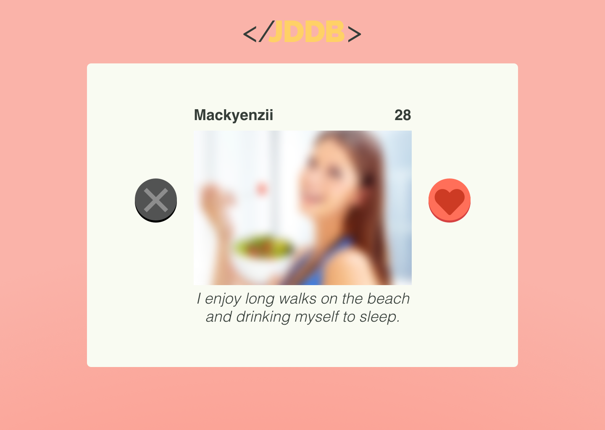
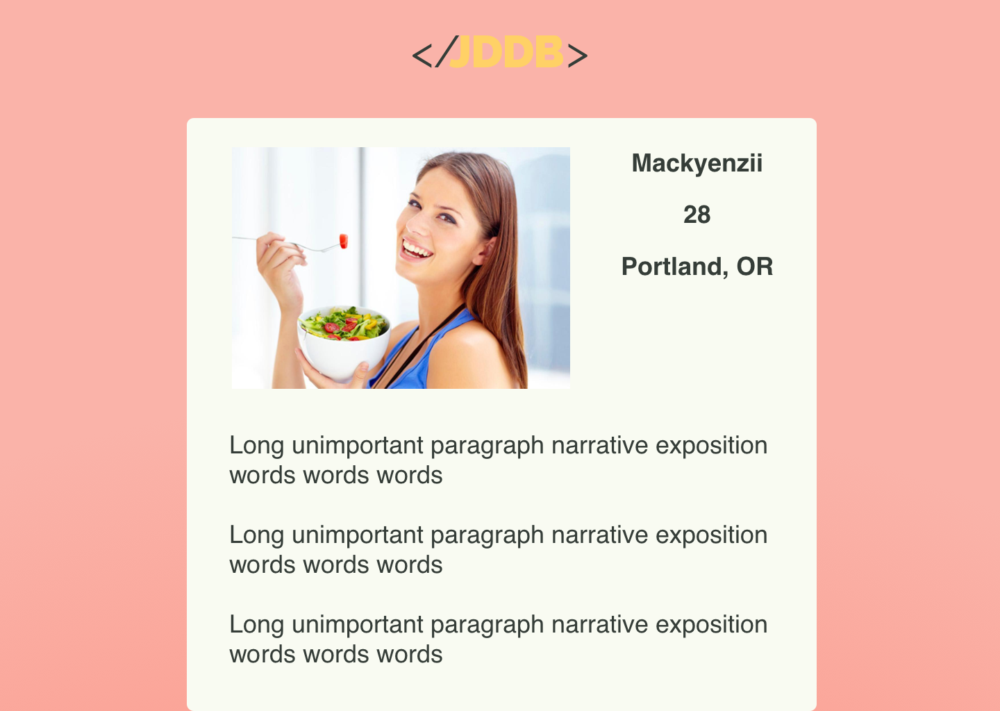
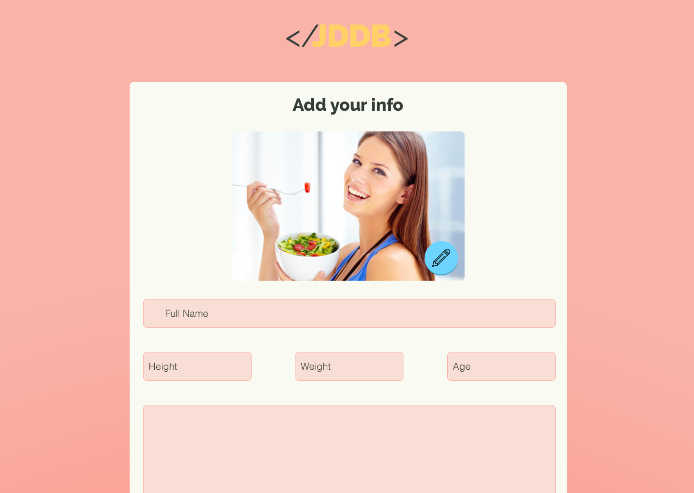
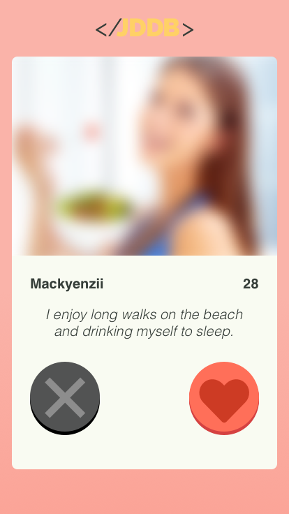

# JDDB
## A dating app
####  By Bobby Martin, Garnett Puett, Ami Cooper, Semhar Kidane and Matt Nardoni

### Description
A dating app with a swiping and matching feature built in Angular and a custom database on heroku.

### User stories
* A user should be able to sort potential matches by selecting their desired partner's orientation (man seeking women)
* A user should be able to like or reject other users.
* A 'liked' user should be appended to a list which will populate another page.

### Setup and installation instructions
API: https://dating-app-server.herokuapp.com/users

  1. If Angular is not installed, run `npm install -g @angular/cli@1.6.5`
  2. Navigate to the project root directory and run `npm install`
  3. To view site on a live development server, run the command `ng serve --open`. This will open the site on a local server and will update whenever changes to the project files are saved.

### Sketches and wireframes
#### Web view sketches
  

  

  

  

#### Mobile view sketches
  

  

  

### Future Goals
* Add the liked users appended page,
* User sessions
* User authentication

### License
*MIT License*

*Copyright (c) [2018]*

*Permission is hereby granted, free of charge, to any person obtaining a copy of this software and associated documentation files (the "Software"), to deal in the Software without restriction, including without limitation the rights to use, copy, modify, merge, publish, distribute, sublicense, and/or sell copies of the Software, and to permit persons to whom the Software is furnished to do so, subject to the following conditions:*

*The above copyright notice and this permission notice shall be included in all copies or substantial portions of the Software.*

*THE SOFTWARE IS PROVIDED "AS IS", WITHOUT WARRANTY OF ANY KIND, EXPRESS OR IMPLIED, INCLUDING BUT NOT LIMITED TO THE WARRANTIES OF MERCHANTABILITY, FITNESS FOR A PARTICULAR PURPOSE AND NONINFRINGEMENT. IN NO EVENT SHALL THE AUTHORS OR COPYRIGHT HOLDERS BE LIABLE FOR ANY CLAIM, DAMAGES OR OTHER LIABILITY, WHETHER IN AN ACTION OF CONTRACT, TORT OR OTHERWISE, ARISING FROM, OUT OF OR IN CONNECTION WITH THE SOFTWARE OR THE USE OR OTHER DEALINGS IN THE SOFTWARE.*

Copyright (c) 2018 Ami Cooper, Garnett Puett, Bobby Martin, Matt Nardoni, and Semhar Kidane
